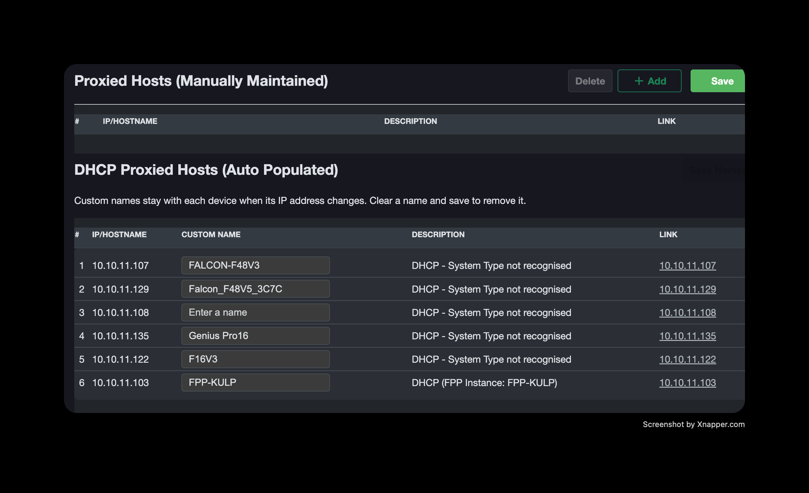

# fpp-dhcp-custom-names

Adds an editable **Custom Name** column for DHCP hosts on FPP's Proxy Settings page. Names follow each device's MAC address, while the automatic Description column keeps working.

This project is a patch installer for Falcon Player, not a plugin installed through FPP's Plugin Manager. Tested with FPP 10.1.2.



## Get the installer

Download this repository using **Code → Download ZIP** and extract it, or clone it with Git. Open a terminal in the extracted repository folder.

## Files to share

Keep these files together when sharing the installer:

- `install.py` — readable Python installer and connection defaults
- `custom-names.patch` — plain-text FPP source changes
- `dhcp-custom-names.php` — isolated PHP regression tests
- `README.md` — these instructions

Unzip before running. No Base64 code, pip packages, or source downloads are required.

## Connection defaults

Near the top of `install.py`:

```python
FPP_IP_ADDRESS = "10.10.11.1"
FPP_USER_NAME = ""       # Example: "fpp"
FPP_USER_PASSWORD = ""   # Example: "falcon"
```

The user name and password are blank by default. The installer prompts for missing credentials; password input is hidden. You can also pass `--user` or edit these variables locally. No `.env` file is used. Keep credentials blank in any copy you publish or share. Use `--ask-password` to override a locally configured password. SSH keys are still used when available.

## Run from a Mac or Linux computer

Open a terminal in this folder. Check compatibility and then install:

```sh
python3 install.py --check
python3 install.py
```

To select another FPP:

```sh
python3 install.py 192.168.1.50 --check
python3 install.py 192.168.1.50
```

The equivalent named option is `--ip`:

```sh
python3 install.py --ip 192.168.1.50 --user fpp --ask-password
```

Additional options include `--port`, `--identity`, and `--known-hosts`. Run `python3 install.py --help` for details. SSH records new host keys automatically and rejects changed host keys.

Python 3.8+ and OpenSSH are required on the sending computer. FPP needs Python 3.8+, PHP, and git. The SSH account must have passwordless sudo for installation; `--check` does not need sudo. The password variable is the SSH login password, not a sudo password.

## Run directly on FPP instead

Copy the three code files to the player, keep them together, and run:

```sh
python3 install.py --local --check
sudo python3 install.py --local
```

Use `--root` and `--media-dir` if FPP is installed outside `/opt/fpp` and `/home/fpp/media`.

## Installation and upgrades

The installer applies the readable patch to the current source, preserving unrelated changes when the patch still matches. It checks PHP syntax and runs isolated regression tests before changing live files. An existing installation is detected and left alone. Incompatible versions and partial installations are rejected without changing live files.

Each new installation creates a timestamped backup in FPP's media `backups` directory. Files are replaced atomically, and original source is restored if a write fails. An abrupt power loss during the multi-file installation may require manual rollback.

Existing labels in `media/config/dhcp-proxy-names.json` are preserved. No FPP restart or network changes are needed. Refresh the Proxy Settings page, enter labels, and click **Save Names**.

Tested with FPP 10.1.2. After an upgrade, run the check again. Future releases may require adapting the patch; do not force a rejected patch or replace newer FPP source with old copies.

## Rollback and label backups

Installation prints its backup path and an exact rollback command. On the player, use the actual filename:

```sh
sudo tar -xzf /home/fpp/media/backups/dhcp-custom-names-before-TIMESTAMP.tar.gz -C /opt/fpp www
```

This restores source files only and keeps current labels. Use the backup corresponding to the current FPP version.

Before an OS reimage, copy `media/config/dhcp-proxy-names.json` off the player. Reinstalling the feature cannot recreate lost labels. Player backups and labels are not automatically copied into this installer folder. Inclusion of the custom JSON in FPP's built-in backups has not been verified.

## Verification

Ten automated tests passed, covering connection defaults, overrides, prompts for missing credentials, password transport, readable packaging, compatibility checks, repeat installation, unrelated source changes, incompatible and partial installations, and rollback after a simulated write failure. PHP regression tests cover persistence, validation, Unicode, clearing labels, and MAC identity across simulated IP changes. The SSH check also recognized the live installation without changing it.
